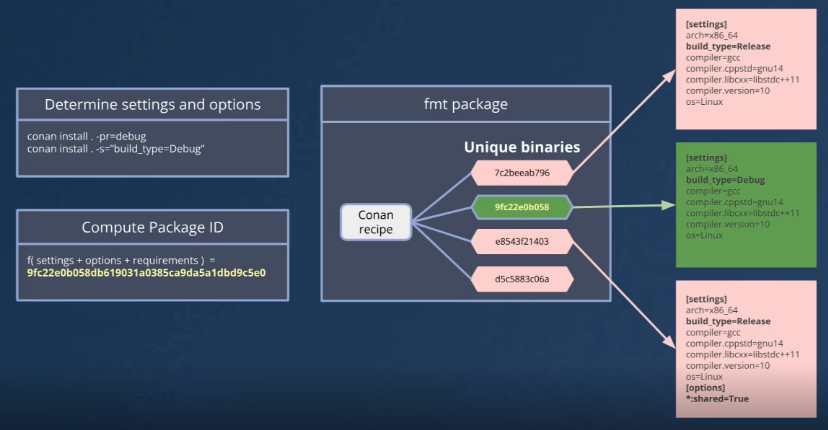

# Conan2

# Lesson 1: Building a Simple CMake Project

```sh
$ conan profile detect --force
$ conan config home
$ cmake --list-presets
Available configure presets:

  "conan-release" - 'conan-release' config
$ cmake --preset=conan-release
$ cmake --build --preset=conan-release
```

# Lesson 2: Building for Multiple Configurations with Conan and CMake Presets

```sh
$ conan config home
/home/burak/.conan2

$ cp /home/burak/.conan2/profiles/defalt /home/burak/.conan2/debug
[settings]
arch=armv8
build_type=Debug # change Release to Debug
compiler=gcc
compiler.cppstd=gnu17
compiler.libcxx=libstdc++11
compiler.version=11
os=Linux

$ conan install . --build=missing -pr=debug
$ cmake --list-presets
$ cmake --preset=conan-debug
$ cmake --build --preset=conan-debug
$ ./build/Debug/formatter 
Conan is a MIT-licensed, Open Source package manager for C and C++ development
Debug configuration!

$ conan install . --build=missing
$ cmake --list-presets
$ cmake --preset=conan-debug
$ cmake --build --preset=conan-debug
$ ./build/Debug/formatter 
Conan is a MIT-licensed, Open Source package manager for C and C++ development
Release configuration!
```

## Use Dependencies as Shared Libraries

```sh
$ conan install . --build=missing --options="*:shared=True"
$ cmake --list-presets
$ cmake --preset=conan-debug
$ cmake --build --preset=conan-debug
./build/Release/formatter 
./build/Release/formatter: error while loading shared libraries: libfmt.so.11: cannot open shared object file: No such file or directory

# --- activate environment for dynamic library paths
. ./build/Release/generators/conanrun.sh
Conan is a MIT-licensed, Open Source package manager for C and C++ development
Release configuration!

# --- deactivate environment
. ./build/Release/generators/deactivate_conanrun.sh
```

## Changing Configurations
- Settings
 - Global configurations (e.g., OS, compiler, build type)
  - `conan install . --profile=debug`
  - `conan install . --settings="build_type=Debug"`
- Options
 - Package-specific features (e.g., shared or static linkage, specific package options)
  - `conan install . --options="*:shared=True"`
  - `conan install . --profile="release-shared"`
  
When we change options for package, conan re-calculate package id for its specific

```sh
$ conan list
$ conan list "fmt/11.2.0:*" --format=compact
Local Cache
  fmt/11.2.0
    fmt/11.2.0#579bb2cdf4a7607621beea4eb4651e0f%1746298708.362 (2025-05-03 18:58:28 UTC)
      fmt/11.2.0#579bb2cdf4a7607621beea4eb4651e0f:2e007bbb95a7fac03b7567775da2fb8227a1a026
        settings: Linux, armv8, Release, gcc, gnu17, libstdc++11, 11
        options: header_only=False, shared=True, with_os_api=True, with_unicode=True
      fmt/11.2.0#579bb2cdf4a7607621beea4eb4651e0f:30e0547eeed712e0ea09e4344fa47e4ce968de11
        settings: Linux, armv8, Debug, gcc, gnu17, libstdc++11, 11
        options: fPIC=True, header_only=False, shared=False, with_os_api=True, with_unicode=True
      fmt/11.2.0#579bb2cdf4a7607621beea4eb4651e0f:917d6f4b7b66f8e403f903534d83ecd1e03d05eb
        settings: Linux, armv8, Release, gcc, gnu17, libstdc++11, 11
        options: fPIC=True, header_only=False, shared=False, with_os_api=True, with_unicode=True
```

1. Conan determines settings and options
    ```
    conan install . -pr=debug
    conan install . -s="build_type=Debug"
    ```
2. Conan compute Package ID
    ```
    f ( settings + options + requirements ) = gfcc22e0...
    ```
3. If package already cached with package ID, conan uses it, if not it checks remote, then build from source
    

# Lesson 3: conanfile.txt vs conanfile.py

```
[requires]
fmt/11.2.0

[generators]
CMakeDeps
CMakeToolchain

[layout]
cmake_layout
```

```py
from conan import ConanFile
from conan.tools.cmake import cmake_layout

class FormatterRecipe(ConanFile):
    settings = "os", "compiler", "build_type", "arch"
    generators = "CMakeToolchain", "CMakeDeps"

    def requirements(self):
        self.requires("fmt/11.2.0")
    
    def layout(self):
        cmake_layout(self)
```

We can extend capability,

```py
from conan import ConanFile
from conan.tools.cmake import cmake_layout, CMakeToolchain, CMakeDeps
from conan.tools.build import valid_min_cppstd
from conan.errors import ConanInvalidConfiguration


class FormatterRecipe(ConanFile):
    settings = "os", "compiler", "build_type", "arch"

    options = {"with_std_format": [True, False]}
    default_options = {"with_std_format": False}

    def validate(self):
        if (self.options.with_std_format and
                not valid_min_cppstd(self, 20)):
            raise ConanInvalidConfiguration("std::format requires C++20")

    def generate(self):
        tc = CMakeToolchain(self)
        tc.cache_variables["USE_STD_FORMAT"] = self.options.with_std_format
        tc.generate()

        cd = CMakeDeps(self)
        cd.generate()

    def requirements(self):
        if not self.options.with_std_format:
            self.requires("fmt/11.2.0")

    def layout(self):
        cmake_layout(self)
```

```sh
conan install conanfile_complete.py --build=missing \
  -o="&:with_std_format=True" \
  -s="compiler.cppstd=20"
```

# Lesson 4: Using build tools as conan package

```py
from conan import ConanFile
from conan.tools.cmake import cmake_layout

class FormatterRecipe(ConanFile):
    settings = "os", "compiler", "build_type", "arch"
    generators = "CMakeToolchain", "CMakeDeps"

    def requirements(self):
        self.requires("fmt/11.2.0")

    def build_requirements(self):
        self.tool_requires("cmake/3.31.5")
        self.tool_requires("gcc/15.2.0")

    def layout(self):
        cmake_layout(self)
```

```sh
conan install . --build=missing

# our current cmake version
cmake --version 
# activate virtual environment
. build/Release/generators/conanbuild.sh
cmake --version

cmake --preset=conan-release
cmake --build --preset=conan-release

./build/Release/formatter 
```

# Lesson 5: Cross Building

```profiles/raspberry
[settings]
os=Linux
arch=armv7hf
compiler=gcc
build_type=Release
compiler.cppstd=gnu14
compiler.libcxx=libstdc++11
compiler.version=12
[buildenv]
CC=arm-linux-gnueabihf-gcc-12
CXX=arm-linux-gnueabihf-g++-12
LD=arm-linux-gnueabihf-ld
```

```sh
conan install . --build missing --profile:build=default --profile:host=./profiles/raspberry
# activate the build environment so that we use the selected CMake version for building
source build/Release/generators/conanbuild.sh

# build our application for the Raspberry Pi
cmake --preset conan-release
cmake --build --preset conan-release

# check that we built the correct architecture
file ./build/Release/formatter 
```

# Lesson 6:

- Recipe versions
- Version ranges
- Lockfiles

## Recipe revisions

```sh
conan list "fmt/11.0.2#*" -r=conancenter
```

| Range                    | Versions in      | Versions out |
| -----------------------  | -----------      | ------------ |
| fmt/[>=11 <12]           | 11.0, 11.5       | 12.0         |
| fmt/[~11.1]                | 11.1.0, 11.1.3 | 11.2         |
| fmt/[>=10 <11 \| >= 11.1]| 11.3, 11.2       | 11.0         |

```sh
$ conan lock create .
$ conan install . -b=missing # it will use the exact versions
```

# Lesson 7: Scanning C++ packages for vulnerabilities using Conan Audit

- registering and configuring the public provider
- Scanning our project
- Generating reports in different formats
- Configuring a private provider

[conan audit](https://audit.conan.io/register)

```sh
$ conan audit provider auth conancenter --token=<your_token_here>
$ conan audit scan .
$ conan audit list libpng/1.6.32
$ conan audit list libpng/1.6.32 --format=html > report.html

$ conan audit provider add myprovider --type=private --url=https://your.artifactory.url --token=<your_token>
$ conan audit scan . --provider=myprovider
```
